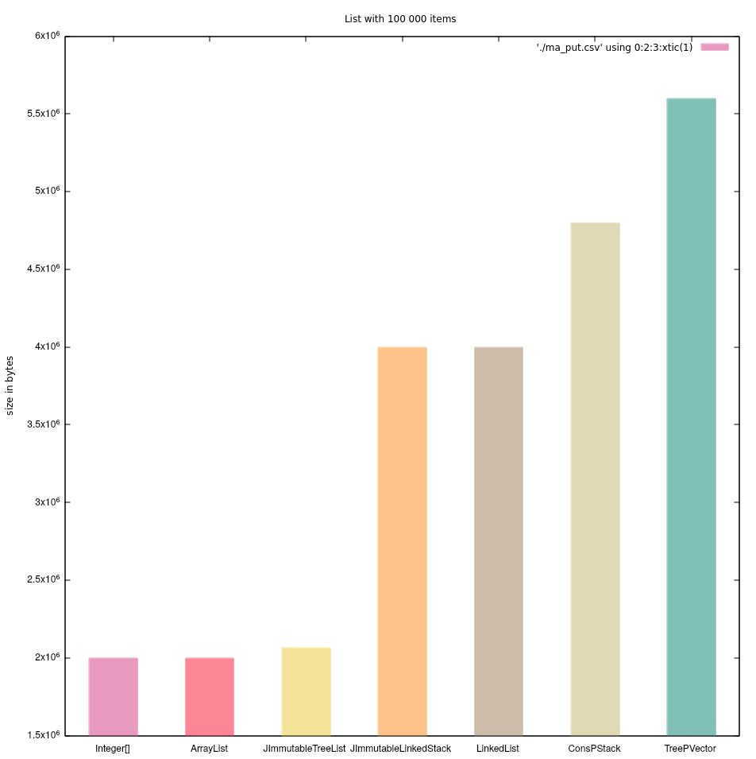
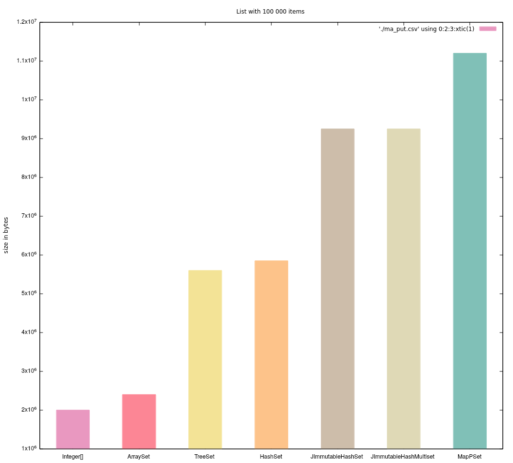
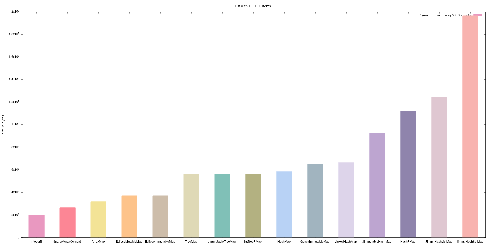

Couple of measurements of object size in Java

Build:
```
./gradlew build
```
Run:
```
./gradlew run
```
Guides how to measure object size:
* https://www.baeldung.com/java-size-of-object
* https://www.javaspecialists.eu/archive/Issue142.html
* https://stackoverflow.com/questions/54162849/can-i-measure-the-size-of-a-list-in-the-memory-including-elements-using-instrume
* https://github.com/jbellis/jamm

### Mutable vs immutable collections in terms of size
Comparision between:
* Standard JDK mutable collections
* Persistent collections https://github.com/hrldcpr/pcollections
* Eclipse collections mutable and immutable https://github.com/eclipse/eclipse-collections
* Guava immutable collections
* Java immutable collections https://github.com/brianburton/java-immutable-collections
* Androidx collections like ArraySet, SparseArray

#### List with 100 000 items
| List\<Integer> | Size in bytes |
| ------ | ------ |
| Integer[] | 1997968 |
| ArrayList | 1997992 |
| JImmutableTreeList | 2064624 |
| JImmutableLinkedStack | 3997976 |
| LinkedList | 3997984 |
| ConsPStack | 4797984 |
| TreePVector | 5598048 |



#### Set with 100 000 items
| Set\<Integer> | Size in bytes |
| ------ | ------ |
| Integer[] | 1997968 |
| ArraySet | 2398016 |
| JImmutableTreeSet | 5598032 |
| TreeSet | 5598032 |
| HashSet | 5846624 |
| JImmutableHashSet | 9246216 |
| MapPSet | 11198104 |



#### Map with 100 000 items
| Map\<Integer, Integer> | Size in bytes |
| ------ | ------ |
| Integer[] | 1997968 |
| SparseArrayCompat | 2646576 |
| ArrayMap | 3186664 |
| EclipseMutableMap | 3695152 |
| EclipseImmutableMap | 3695168 |
| TreeMap | 5598000 |
| JImmutableTreeMap | 5598008 |
| IntTreePMap | 5598024 |
| HashMap | 5846608 |
| GuavaImmutableMap | 6495176 |
| LinkedHashMap | 6646600 |
| JImmutableHashMap | 9246200 |
| HashPMap | 11198088 |

